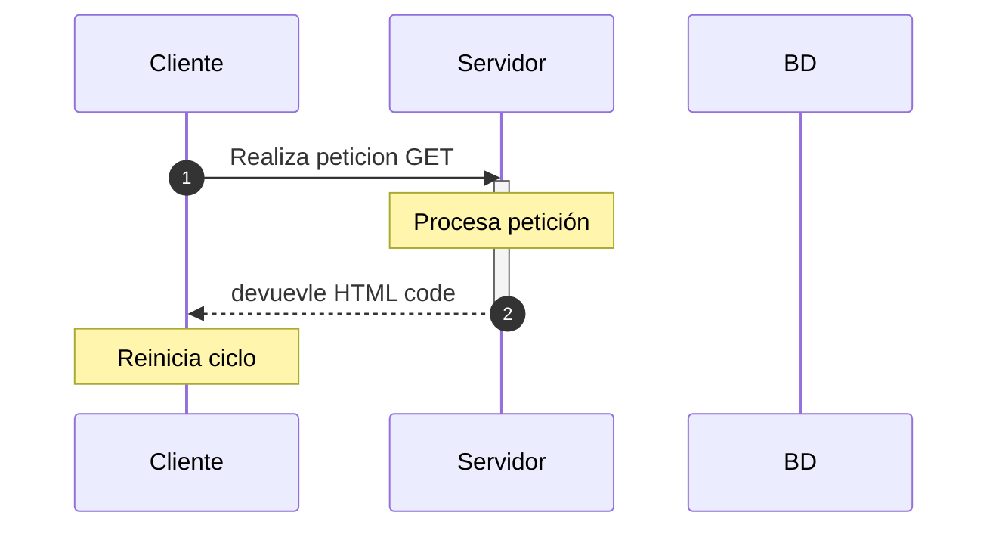

# Diaagrama de Secuencia 0.5

  Diagrama que representa la aplicacion de una sola pagina

```mermaid
sequenceDiagram
  autonumber
  participant B as Cliente
  participant A as Servidor
  participant C as BD

  B->>A: Realiza peticion GET
  activate A
  Note over A: Procesa petición
  A-->>B: devuevle HTML code
  deactivate A
  activate C
  Note over B: Reinicia ciclo
```
