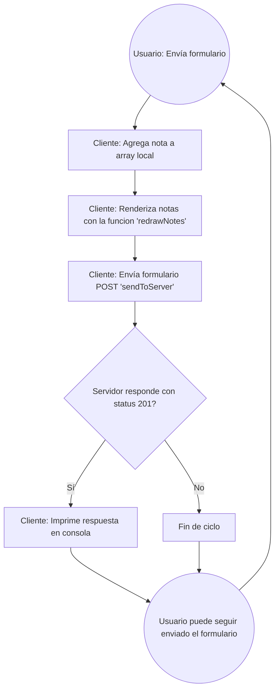

# Diagrama de Secuencia 0.6

  Diagrama que representa la inserccion de una nueva nota.

```mermaid
flowchart TD
  A((Usuario: Envía formulario)) --> B[Cliente: Agrega nota a array local]
  B --> C[Cliente: Renderiza notas con la funcion 'redrawNotes']
  C --> D[Cliente: Envía formulario POST 'sendToServer']
  D --> E{Servidor responde con status 201?}
  E -->|Sí| F[Cliente: Imprime respuesta en consola]
  E -->|No| G[Fin de ciclo]
  F --> H((Usuario puede seguir enviado el formulario))
  G --> H
  H --> A
```
