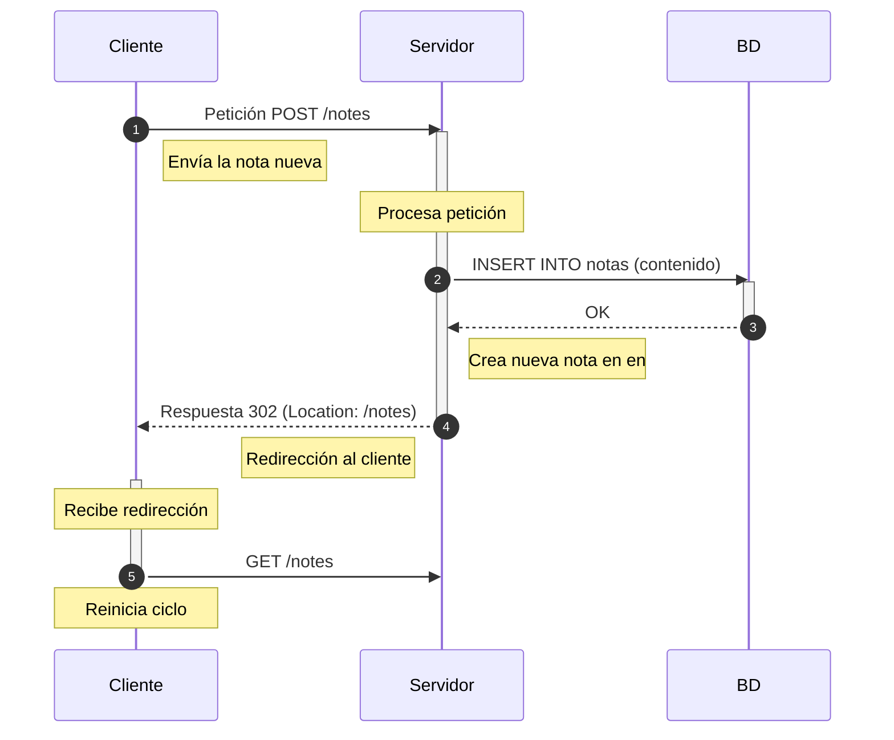

# Diaagrama de Secuencia 0.6

  Diagrama que representa la peticion que se realiza una vesz se envia una nota en el formulario y el servidor recibe la peticion.

```mermaid
sequenceDiagram
  autonumber
  participant B as Cliente
  participant A as Servidor
  participant C as BD

  B->>A: Petición POST /notes
  activate A
  Note right of B: Envía la nota nueva
  Note over A: Procesa petición
  A->>C: INSERT INTO notas (contenido)
  activate C
  C-->>A: OK
  deactivate C
  Note right of A: Crea nueva nota en en
  A-->>B: Respuesta 302 (Location: /notes)
  deactivate A
  Note left of A: Redirección al cliente
  activate B
  Note over B: Recibe redirección
  B->>A: GET /notes
  deactivate B
  Note over B: Reinicia ciclo
```
